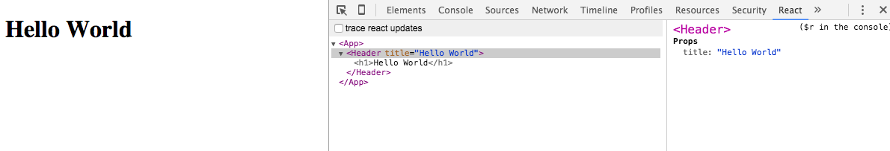
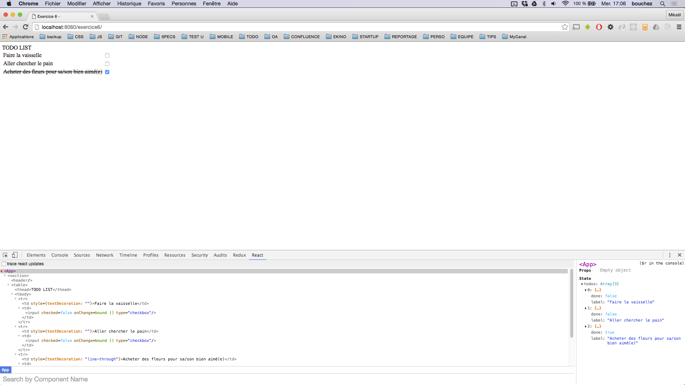

# lpdw-tp


## Exercice 1 :

### JSX

Le premier exercice consiste a créer le composant le plus simple du monde et de le rendre dans une page html.

* Utiliser le fichier `./exercice1/hello-world.html`
* Utiliser la méthode `ReactDOM.render` pour créer un composant ***HelloWorld***
* Lancer la commande `npm run exercice1` pour voir votre résultat (http://localhost:8080)
* Répondez aux questions posées dans le fichier `./exercice1/README.md`

**CONSEILS**

Le fichier `./exercice1/hello-world.html` inclus toutes les librairies utilisées pour mener a bien l'exercice. Votre seule préoccupation dans cette exercice et de comprendre et d'utiliser la méthode `ReactDOM.render`. En répondant au questions vous trouverez naturelement la solution.

**RESULTAT ATTENDU**


## Exercice 2 :

### Utilisation de javascript dans du JSX

L'exercice suivant consiste a utiliser du javascript dans le JSX.

* Commencer en faisant un copier/coller du fichier `hello-world.html` de l'exercice1 dans le dossier `./exercice2`
* Remplacer le mot ***world*** par votre prénom à l'aide de javascript
* Lancer la commande `npm run exercice2` pour voir votre résultat (http://localhost:8080)
* Répondez aux questions posées dans le fichier `./exercice2/README.md`

**RESULTAT ATTENDU**


## Avant d'aller plus loin

L'une des principale fonctionnalité de React est de créer des composants, ou des vues imbriquées les une dans les autres pour créer des applications complexes et dynamiques.

L'organisation de vos composants est un élément essentiel à la maintenance de votre code et sera de rigueur lorsque vous travaillerez en équipe.

Lors des précédents exercices, nous utilisions le JSX et le javascript au sein même d'un fichier html. Compte tenu des paragraphes précédents, aborder un projet complexe de cette manière s'avère être une tâche difficile et ennuyeuse.

Heureusement, des outils sont a notre disposition pour organiser le code. Nous en avons abordé quelques un en cours.

* webpack => unifier votre code sous forme de modules
* babel => transpiler votre code de la norme `ecma script 5` à la norme `es2015`

En utilisant ces outils vous devez être capable d'organiser votre code et augmenter votre productivité.

*** ! L'architecture (webpack + babel) pour les exercices suivants est déjà mise en place. Il s'agit d'exercices concernant ReactJS rien d'autre. ***


*** ! Suivre les étapes une par une et répondre aux questions des fichiers README vous aideront grandement dans la réussite d'un exercice. ***

*** ! Utiliser la syntaxe `es2015` (`es6`) pour tous vos développements. ***

*** ! Chaque exercice est consideré comme une application React autonome s'executant via une ligne de commande. ***

*** ! Tous les fichiers et dossiers que vous créerez pour un exercice X devront se situer dans le sous dossier `./exerciceX/` correspondant sauf indication contraire. Je tiendrais rigueur de l'organisation des fichiers, dossiers, sous-dossiers ainsi que de la qualité du code et la pertinance des commentaires. Sachez que la communauté regorge de bonnes pratiques et que nous en avons vu en cours ***

*** ! Pour chaque exercice, le fichier `./exerciceX/index.html` ne doit pas être modifié. Il contient un élément `<div id="root"></div>` dans lequel sera injecté votre application React.***

*** ! Pour chaque exercice, le fichier `./exerciceX/index.js` constitue la base et le point d'entrée de chaque exercice. Autrement dit de chaque petite application React. Il ne doit en aucun cas être renommé. Dans ce fichier, une petite aide en commentaire vous sera proposé pour que vous puissiez créer votre point d'entrée.***


## Exercice 3 :

### Créer un composant react en utilisant `class` et `extends`

* Créer un composant *HelloWorld* qui hérite de `React.Component` dans un nouveau fichier `HelloWorld`.
* Lancer la commande `npm run exercice3`.
* Ouvrez http://localhost:8080/exercice3 pour voir votre résultat dans votre navigateur
* Répondez aux questions posées dans le fichier `./exercice3/README.md`

**CONSEILS**
* Faire en sorte d'utiliser du javascript dans le JSX de votre composant sera un plus. (cf exercice 2)
* L'extension .jsx de vos fichiers est implicite mais peut vous être suggérée pour différencier les fichiers contenant du JSX et ceux n'en contenant pas (pure JS).

## Exercice 4 :

### Utiliser les `props`

* Dans le dossier `./exercice4/` créer 2 composants React : `App.jsx` et `Header.jsx`
* `App.jsx` servira de base à votre application, c'est le container de l'exercice 4.
* `Header.jsx` devra contenir un titre `<h1>` et sera un enfant de `App.jsx`
* Vous devez utiliser `PropTypes` qui fait partie de la librairie React pour passer la propriété `title` au composant `Header.jsx`
* Lancer la commande `npm run exercice4`.
* Ouvrez http://localhost:8080/exercice4 pour voir votre résultat dans votre navigateur
* Répondez aux questions posées dans le fichier `./exercice4/README.md`

**CONSEILS**
* Nommez bien le composant parent `App.jsx`
* Valable pour tous les exercices : la pluspart des choses à savoir et et à faire se trouvent dans la **doc** et les réponses aux **questionnaires**.
* En cas de doute regardez toujours votre console Chrome ou votre terminal dans lequel vous executez Webpack.

**RESULTAT ATTENDU**

Vous pouvez voir la structure du composant React.




## Exercice 5 :

### State et binding

1. Créer dans une nouvelle application React (`./exercice5/`), un composant qui inclus un champ `<input>` et une `<div>`.
* En utilisant les attribut `onChange` du champ input, faites en sorte de rendre le texte que vous tapez dans le champs `input` à l'intérieur de la `div`.
* Lancer la commande `npm run exercice5`.
* Ouvrez http://localhost:8080/exercice5 pour voir votre résultat dans votre navigateur
* Répondez aux questions posées dans le fichier `./exercice5/README.md`

**CONSEILS**
* Vous devrez utiliser la propriété `state` de votre composant. (Rapellez vous que le `state` est un objet qui définit l'état de votre composant. Dès qu'une valeur du `state` change, la méthode `React.render` est à nouveau invoquée.
* Pensez à la méthode `constructor` pour définir l'état par défaut de votre composant.
* Rapellez vous qu'une classe React (comme votre composant), est un **objet** javascript. Pour garder la référence à cet **objet** vous aurez besoin de ***binder*** la méthode `onChange`:

    `<input type="text" onChange={this.votreMethode.bind(this)}` vs

    Ainsi dans le bloc `votreMethode () { ... }`, `this` fera reférence à votre **objet** (composant). Vous pourrez ainsi manipuler son `state`.

* Valable pour tous les exercices : la pluspart des choses à savoir et et à faire se trouvent dans la **doc** et les réponses aux **questionnaires**.
* En cas de doute regardez toujours votre console Chrome ou votre terminal dans lequel vous executez Webpack.

[](http://www.youtube.com/watch?v=_wwGILAJdI4)

## Exercice 6 :

### A vous de jouer ! Création d'une TODO LIST

Vous devez créer un composant React TodoList. C'est une simple liste comportant des tâches à réaliser et des _checkboxes_.
Lorsque vous cocher une _box_, le label de la liste doit se barrer.



Voici le model que vous pouvez utiliser :

```
const todos = [
    {
        label: 'Faire la vaisselle',
        done: false
    },
    {
        label: 'Aller chercher le pain',
        done: false
    },
    {
        label:'Acheter des fleurs pour sa/son bien aimé(e)',
        done: true
    }
];
```

Un bonus vous sera accordé si y incorporez du style CSS ou en ajoutant des fonctionnalitées.


Bon courage !
